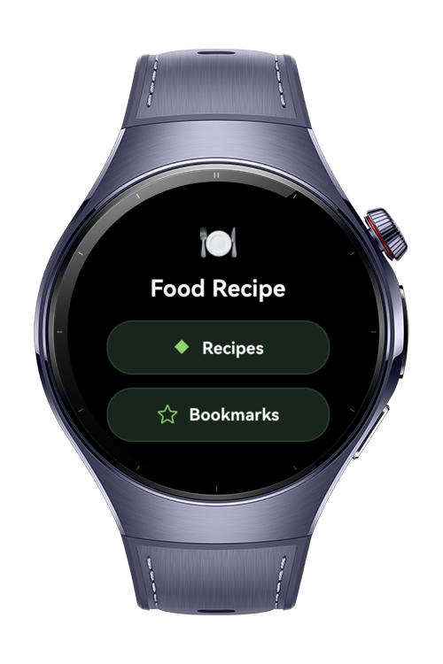
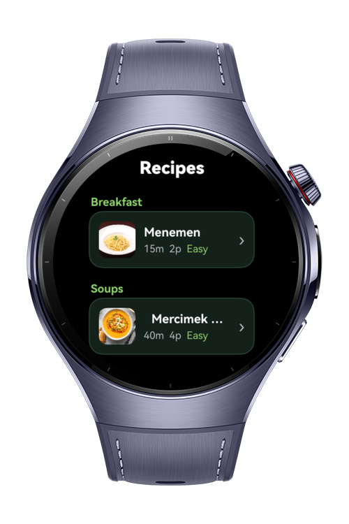
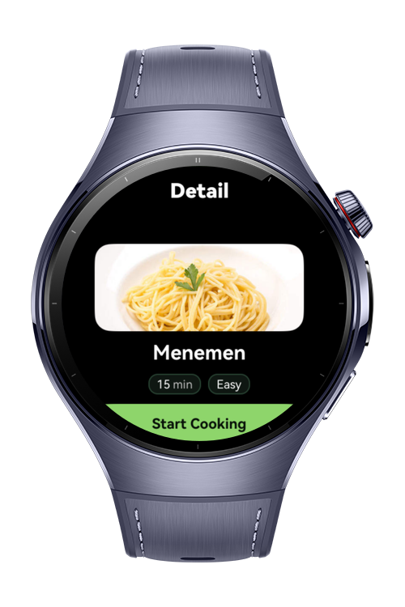
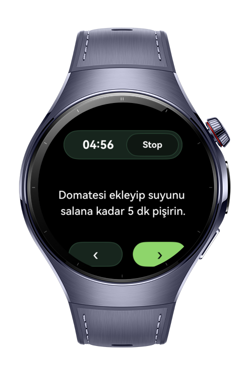

> **Note:** To access all shared projects, get information about environment setup, and view other guides, please visit [Explore-In-HMOS-Wearable Index](https://github.com/Explore-In-HMOS-Wearable/hmos-index).

# Food Recipe 
This app is a lightweight and intuitive recipe manager designed for HarmonyOS wearable devices using **ArkTS/ArkUI** for HarmonyOS. Users can explore delicious recipes, add them to favorites (bookmarks), and manage them locally using **RDB (Relational Database)**

# Preview
<div>




</div>

# Use Cases
- **Main Index Page**:  
  Offers two options — Bookmarks and Recipes.

- **Recipe Exploration**:  
  Selecting Recipes opens a swiper-based list. Users can view details and bookmark recipes.

- **Bookmark Management**:  
  Favorites displays all bookmarked recipes. Tapping on any allows the user to remove it.

# Technology
## Stack
- **Languages**: ArkTS/ArkUI
- **Frameworks**: HarmonyOS SDK 6.0.0(20)
- **Tools**: DevEco Studio 5.1.0.260+
- **Libraries**:
  - `@kit.ArkUI` – UI components and Navigation
  - `@kit.ArkData` (`relationalStore`) – Local relational database for bookmarks
  - `@kit.AbilityKit` – UIAbility and lifecycle
  - `@kit.PerformanceAnalysisKit` (`hilog`) – Structured logging

# Directory Structure
```
entry/
└── ets/
    ├── component/
    │   └── RecipeCard.ets             # UI component for displaying individual recipes
    ├── constants/
    │   └── CommonConstantsDb.ets      # RDB constants and table schema
    ├── entryability/
    │   └── EntryAbility.ets           # Main app launcher
    ├── entrybackupability/
    │   └── EntryBackupAbility.ets     # Backup launch logic
    ├── model/
    │   └── Recipe.ets                 # Recipe model interface
    ├── pages/
    │   ├── Index.ets                  # Main navigation (Recipes & Bookmarks)
    │   ├── DetailPage.ets             # Recipe detail with bookmark toggle
    │   ├── favorites/
    │   │   └── FavoritePage.ets       # Bookmarked recipes list
    │   └── recipes/
    │       └── RecipesPage.ets        # Recipe swiper page
    ├── service/
    │   ├── FavoriteTable.ets          # RDB operations for bookmarks
    │   └── Rdb.ets                    # Generic RDB wrapper
    ├── util/
    │   └── Logger.ets                 # hilog-based logging utility
    └── viewmodel/
        ├── RecipesDetailViewModel.ets # Bookmark ViewModel
        └── RecipesViewModel.ets       # Recipe catalog (seed data)

```

# Constraints and Restrictions
## Supported Device
- Huawei watch 5

# LICENSE
**Food Recipe** is distributed under the terms of the MIT License.
See the [LICENSE](/LICENSE) for more information.
